# AWS Ops Lab

Hands-on lab covering first-line cloud operations on AWS (eu-west-1): Linux and Windows Server
administration on EC2, security group troubleshooting, CloudWatch alerting with an escalation
runbook, and a GitHub Actions CI/CD pipeline to Amazon S3.

**Skills shown:** EC2 (Linux and Windows) · security groups · IAM least privilege · CloudWatch and SNS · runbooks and escalation · Git and GitHub Actions · S3 static hosting · structured troubleshooting

## What I built

- **Linux:** Amazon Linux 2023 on EC2 with nginx; patched with dnf; managed with systemctl and journalctl
- **Windows:** Windows Server 2025 on EC2 via RDP; Event Viewer, Services, local users and groups, PowerShell
- **Monitoring:** CloudWatch alarm (CPU > 70% over 5 minutes) with SNS email alerts and a runbook ([RB-001](runbooks/RB-001-high-cpu.md))
- **CI/CD:** GitHub Actions pipeline that deploys to an S3 static website on every push, with a smoke test

## Architecture

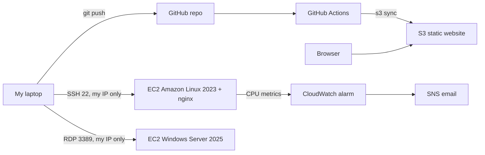

## Troubleshooting cases

| # | Symptom | How I diagnosed it | Root cause | Fix |
|---|---|---|---|---|
| 1 | Browser timed out on port 80 | `curl localhost` on the server returned 200, so the problem was outside the server | No inbound rule for HTTP | Added HTTP rule limited to my IP |
| 2 | Browser showed "connection refused" | Refused (not timeout) meant traffic reached the server; `systemctl status` showed nginx inactive | nginx stopped | Restarted nginx |
| 3 | nginx failed to restart | `nginx -t` pointed to the invalid lines; `journalctl` confirmed | A piped command split over two lines made `tee` write my next commands into nginx.conf | Restored the config from a backup taken before editing |
| 4 | Logs did not match my actions | Event Viewer showed USB and laptop power events | I was looking at my own laptop, not the server (Windows key shortcuts go to the local PC when RDP is not full screen) | Always confirm the host with `hostname` first |
| 5 | SSH timed out after restarting the instance | `Test-NetConnection -Port 22` failed; ping failure was expected (ICMP not allowed) | When adding the HTTP rule I had overwritten the SSH rule; the open session kept working because security groups keep established connections | Re-added the SSH rule; now test with a fresh connection after any firewall change |
| 6 | Pipeline job stuck in "Queued" | Checked githubstatus.com before changing anything | GitHub Actions outage (runner assignment delays) | Waited, no config changes; run #1 completed after the incident |
| 7 | Pipeline failed (red x) | Credentials step passed, so the keys were valid; the upload step logged `NoSuchBucket` | Deliberate test: wrong bucket name in deploy.yml | Corrected the bucket name and pushed again |

## Key evidence

  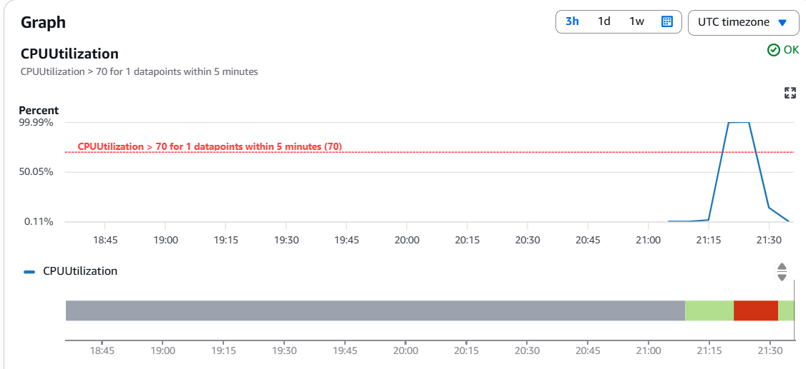
   
  <em>CloudWatch alarm cycle: OK, then In alarm when CPU hit 100%, then back to OK after I stopped the load.</em>

  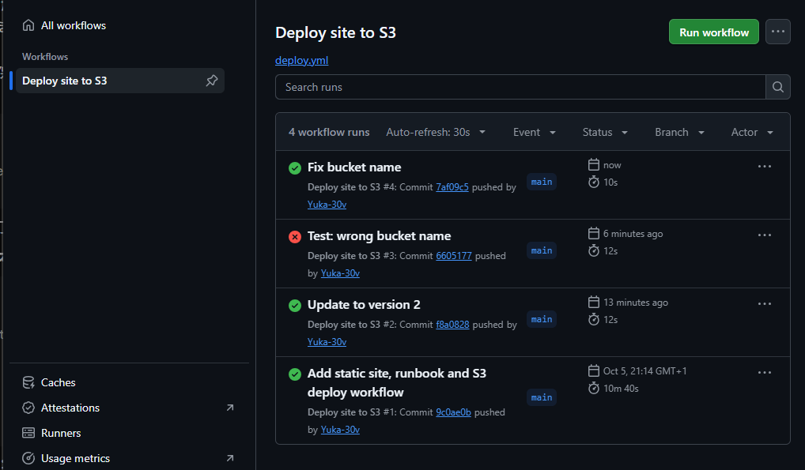
   
  <em>Pipeline history: #1 slowed by a GitHub outage (10m 40s), #2 auto-deployed version 2, #3 deliberate failure, #4 fixed.</em>

## More screenshots

<strong>Linux: security group and service troubleshooting (cases 1 and 2)</strong>

 

  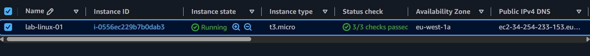
   <em>Amazon Linux instance running in eu-west-1a, all status checks passed.</em>

  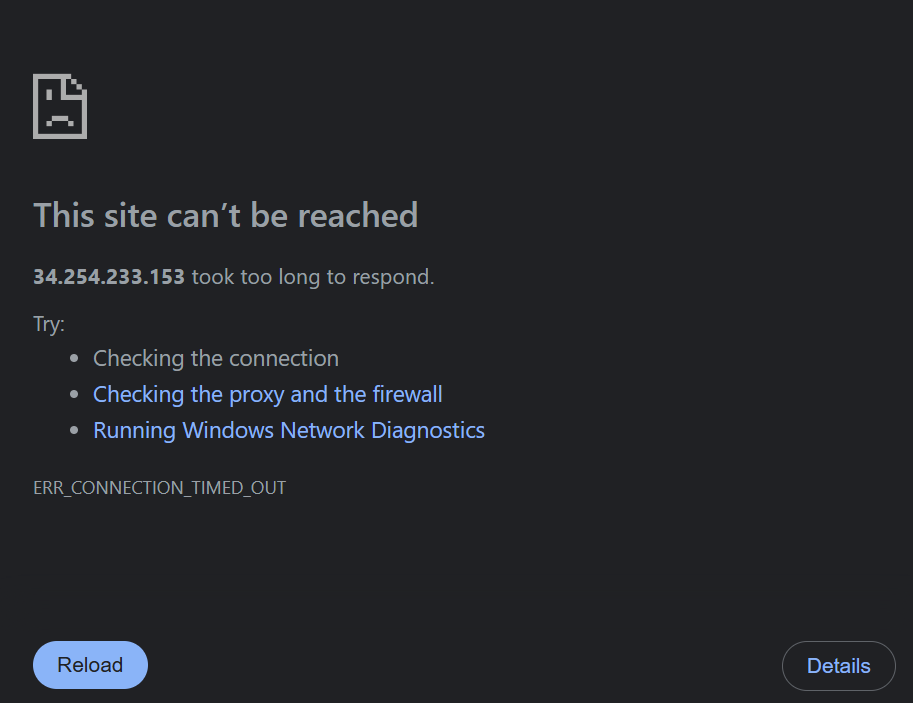
   <em>Case 1: timeout, because the security group had no rule for port 80.</em>

  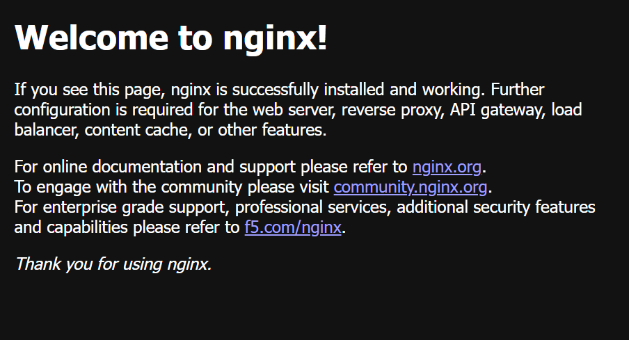
   <em>After adding the HTTP rule (my IP only), nginx is reachable.</em>

  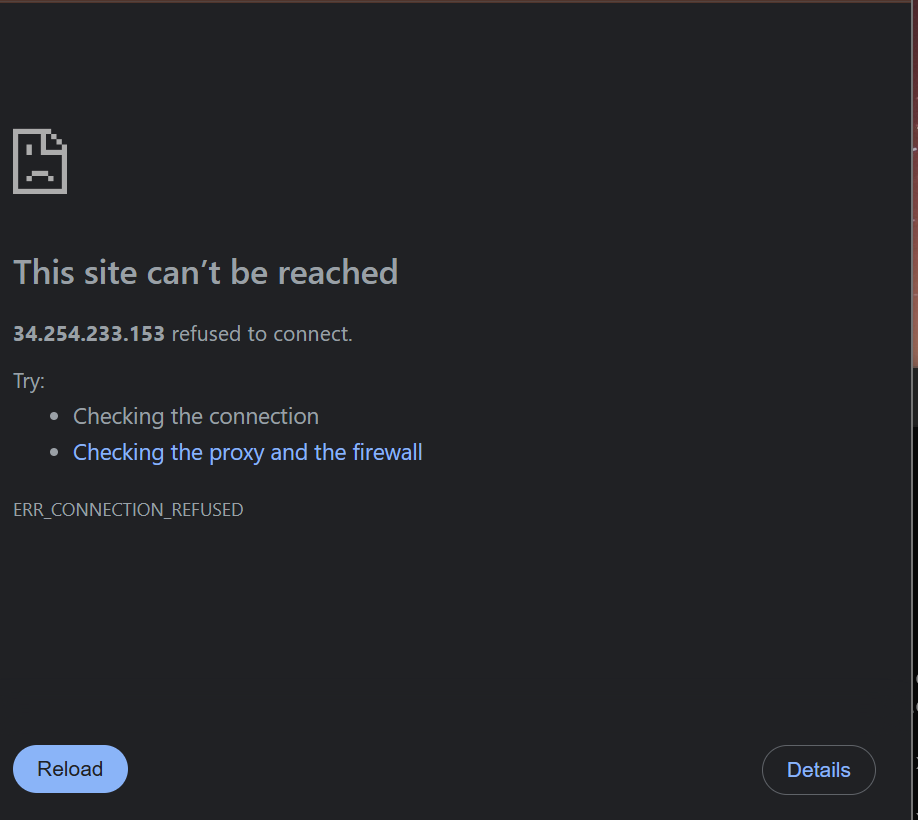
   <em>Case 2: connection refused, because nginx was stopped. Traffic reached the server, but nothing was listening.</em>

<strong>Windows Server 2025</strong>

 

  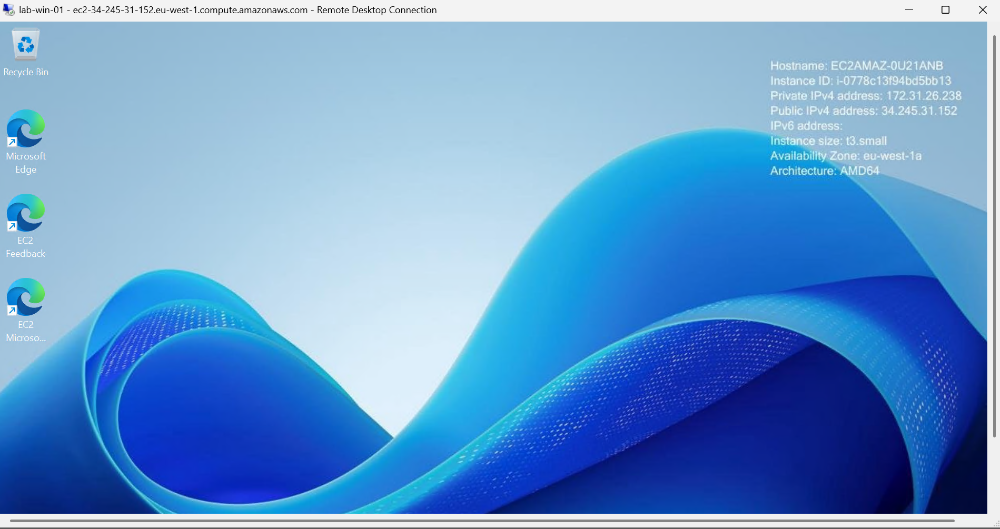
   <em>Windows Server 2025 over RDP (access limited to my IP), used for Event Viewer, Services, local users and network checks.</em>

<strong>CloudWatch alarm test</strong>

 

  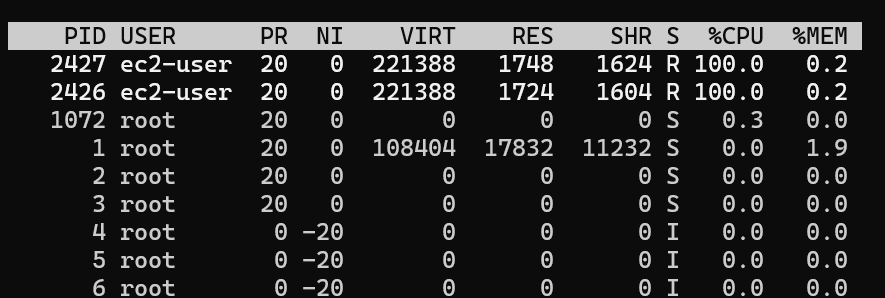
   <em>Two <code>yes</code> processes pushed both vCPUs of the t3.micro to 100%.</em>

  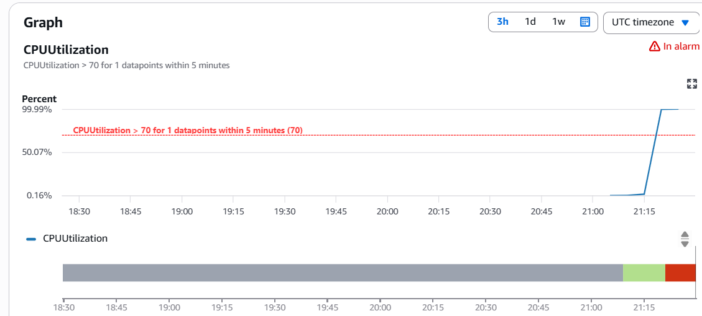
   <em>CPU crossed the 70% threshold and the alarm moved to In alarm, sending an SNS email.</em>

<strong>CI/CD pipeline</strong>

 

  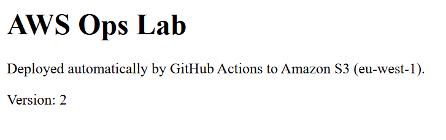
   <em>Changing one line and pushing updated the live S3 site to version 2 automatically.</em>

  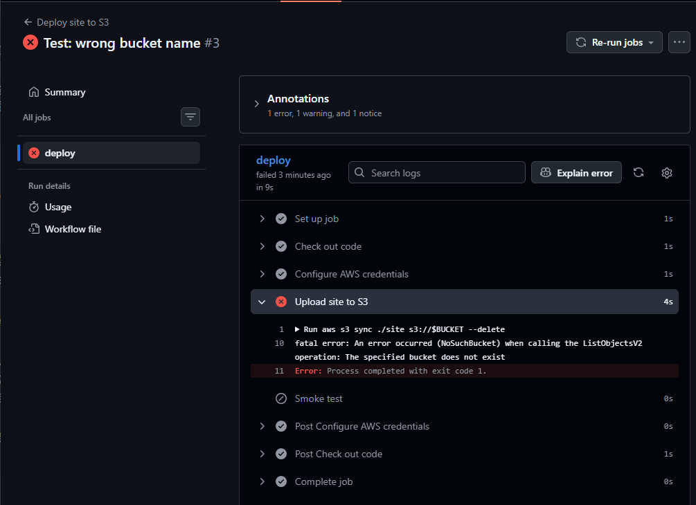
   <em>Case 7: the credentials step passed and the upload step failed with NoSuchBucket, which narrowed the cause to the bucket name.</em>

## Security choices

- Root user protected with MFA; day-to-day work as an IAM user with MFA
- SSH and RDP open to my IP address only
- Deploy user limited to one S3 bucket; access keys stored in GitHub Secrets, never in code

## What I would do next

- Replace long-lived access keys with OIDC (short-lived credentials)
- Serve the site through CloudFront with a private bucket
- Define the infrastructure as code (CloudFormation or Terraform)
